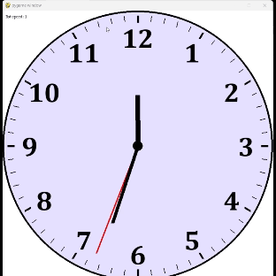

# Animated Clock with Changing Speeds

This project is a Python-based animated analog clock that demonstrates 2D object transformations. Developed using Pygame, the clock features real-time animation of clock hands with adjustable rotation speed. It serves as an educational tool for understanding and visualizing 2D transformations in a fun and interactive way.

## Features
- Real-time animated clock hands
- User control over animation speed using keyboard inputs
- Custom 2D transformations without built-in rotation methods
- Clear visual representation of clock face and hands

## Clock Rotation Algorithm
The main algorithm behind the animated clock involves rotating the clock hands (second, minute, and hour hands) around a central point using custom 2D transformation functions. The algorithm calculates the new positions of the clock hands based on the rotation speed and the current time.

### Steps of the Algorithm:
1. **Initialization**: 
   - Set up the Pygame environment.
   - Define constants for the center of the clock, the radius, and the initial rotation speed.

2. **Rotation Function**: 
   - Define a function to rotate points around the center of the clock. This function converts polar coordinates to Cartesian coordinates.

3. **Main Loop**: 
   - Check for user input to adjust the rotation speed.
   - Clear the screen and draw the clock face and numbers.
   - Update the angles of the clock hands based on the rotation speed.
   - Draw the updated positions of the clock hands.
   - Refresh the display to show the updated clock.

## Usage
1. Install Python and Pygame.
2. Run the script to start the animated clock.
3. Use the UP and DOWN arrow keys to adjust the rotation speed of the clock hands.

## Requirements
- Python 3.6 or higher
- Pygame 2.0 or higher

## Clock animation GIF

## License
This project is licensed under the MIT License - see the [LICENSE](LICENSE) file for details.
